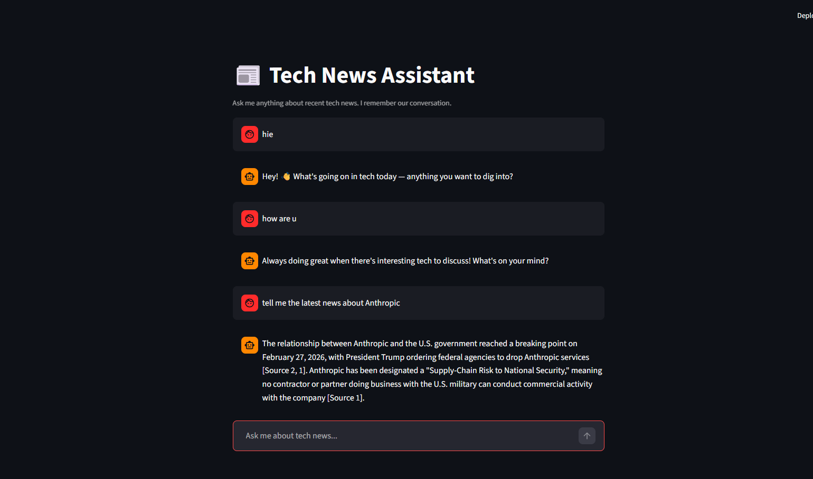
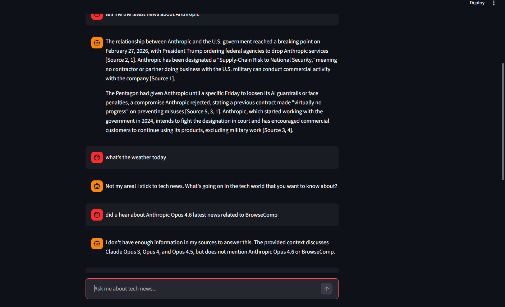
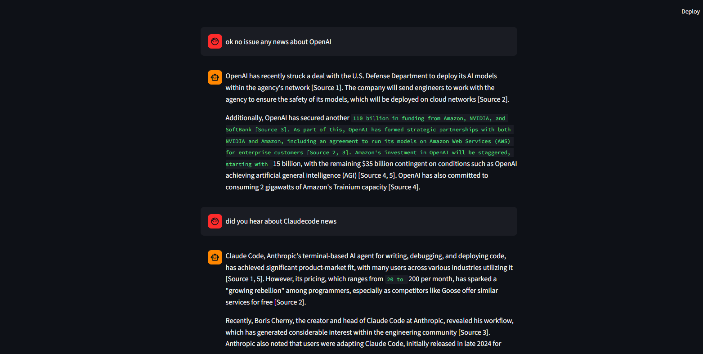
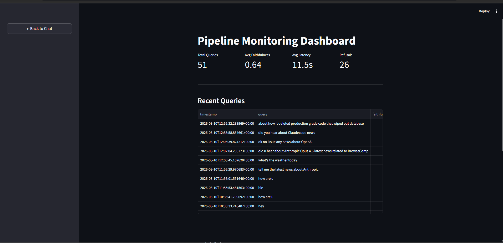

# 📰 Tech News RAG Pipeline with Hallucination Detection

A **self-evaluating RAG pipeline** that ingests real tech news, answers questions grounded in retrieved sources, and automatically detects hallucinated answers using NLI-based faithfulness scoring.

Built on an 8GB RAM laptop with no GPU. Every component chosen to fit a resource constraint while maintaining engineering rigour — no notebook shortcuts.

---

## What Makes This Different

Most RAG tutorials stop at "retrieve chunks → generate answer." This pipeline adds three layers on top:

- **Two-stage query router** — LLM classifier catches off-topic/social queries in ~0.4s before wasting a full retrieval + generation cycle (~10s). Coverage probe then checks if the KB actually has content for on-topic queries.
- **NLI hallucination gate** — every answer is scored for faithfulness against retrieved chunks using a local cross-encoder model. Low-confidence answers are flagged, not blindly served.
- **Conversational memory with query rewriting** — follow-up questions like "tell me more about their funding" are rewritten into standalone queries before retrieval, so context carries across turns.

---

## Demo

### Greeting + Real Question


### Out-of-Scope Rejection + Hallucination Gate


### Conversational Follow-up + Knowledge Gap Handling


### Monitoring Dashboard


---

## Architecture

```
[RSS Feeds: TechCrunch, Ars Technica, The Verge, MIT Tech Review,
           VentureBeat, Engadget, ZDNet, The Next Web + more]
    ↓
[Ingestion: feedparser + HTML stripping + URL-hash deduplication]
    ↓
[Recursive Chunking: 500 chars, 50 overlap]
    ↓
[Embedding: sentence-transformers/all-MiniLM-L6-v2 (384-dim, CPU)]
    ↓
[ChromaDB Vector Store — HTTP container, single source of truth]
    ↓
[User Query]
    ↓
┌─────────────────────────────────────────────────┐
│           TWO-STAGE QUERY ROUTER                │
│                                                 │
│  Stage 1: Groq LLM Classifier (~0.4s)          │
│    SOCIAL    → casual response, no retrieval   │
│    OUT_OF_SCOPE → rejection message            │
│    AMBIGUOUS → clarification request           │
│    ANSWERABLE → proceed to Stage 2             │
│                                                 │
│  Stage 2: ChromaDB Coverage Probe              │
│    distance > 0.65 → LOW_COVERAGE response     │
│    distance ≤ 0.65 → proceed to pipeline       │
└─────────────────────────────────────────────────┘
    ↓ (ANSWERABLE only)
[Query Rewriter — rewrites follow-ups using conversation history]
    ↓
[Top-5 Semantic Retrieval from ChromaDB]
    ↓
[Versioned Prompt (YAML) + Retrieved Chunks + Conversation History]
    ↓
[Google Gemini 2.5 Flash (primary) / Groq Llama 3.3 70B (fallback)]
    ↓
[NLI Hallucination Gate: cross-encoder/nli-deberta-v3-small]
    ├── Faithfulness ≥ 0.65 → serve answer
    └── Faithfulness < 0.65 → flag as low-confidence
    ↓
[Metrics logged to SQLite → Streamlit monitoring dashboard]
```

---

## Routing in Practice

| Query | Stage 1 | Stage 2 | Result |
|-------|---------|---------|--------|
| "hey" | SOCIAL | — | Casual greeting, 0.4s |
| "how are u" | SOCIAL | — | Bot response, 0.4s |
| "what's the weather today" | OUT_OF_SCOPE | — | Rejection, 0.4s |
| "tell me about OpenAI" | ANSWERABLE | PASS | Full answer, ~10s |
| "OpenAI stock price" | OUT_OF_SCOPE | — | Rejection, 0.4s |
| "did u hear about BrowseComp" | ANSWERABLE | FAIL | Low coverage response |
| "tell me more" | AMBIGUOUS | — | Clarification request |

---

## Tech Stack

| Layer | Tool | Why |
|-------|------|-----|
| Data source | RSS feeds (10 sources) | Real, updating data |
| Chunking | Recursive text splitter | Respects sentence boundaries |
| Embedding | all-MiniLM-L6-v2 | 80MB, CPU-friendly, 384-dim |
| Vector store | ChromaDB (HTTP container) | Single source of truth for local + Docker |
| Router Stage 1 | Groq LLM classifier | Fast, cheap, catches domain mismatches |
| Router Stage 2 | ChromaDB coverage probe | Catches on-topic but uncovered queries |
| Query rewriter | Groq | Resolves follow-up references before retrieval |
| LLM | Gemini 2.5 Flash + Groq Llama 3.3 70B | Both free, multi-provider fallback |
| Hallucination gate | cross-encoder/nli-deberta-v3-small | 200MB, CPU, deterministic |
| Prompt management | Versioned YAML (v1/v2/v3) | A/B comparison, full audit trail |
| Monitoring | SQLite + Streamlit dashboard | Zero background memory cost |
| CI/CD | GitHub Actions + pytest | 20 tests, runs on every push |
| Containers | Docker + Compose | ChromaDB HTTP + app + ingest profiles |

---

## Lightweight-First Design

Entire pipeline runs on an **8GB RAM laptop with no GPU**:

| Component | Memory footprint |
|-----------|-----------------|
| Embedding model (all-MiniLM-L6-v2) | ~80MB |
| NLI model (nli-deberta-v3-small) | ~200MB |
| LLM inference | 0MB (remote API) |
| ChromaDB | ~50MB (HTTP container) |
| Streamlit app | ~150MB |

No Airflow, no Prometheus/Grafana overhead. Proves that good GenAI engineering is about architecture decisions, not infrastructure budget.

---

## Setup

```bash
git clone https://github.com/vk20001/news-rag.git
cd news-rag

# API keys — both free, no credit card needed
# Gemini: https://ai.google.dev
# Groq: https://console.groq.com
cp .env.example .env
# Edit .env and add GEMINI_API_KEY and GROQ_API_KEY

# Start ChromaDB + app
docker compose up -d

# Ingest latest news
docker compose --profile ingest run ingest

# Open http://localhost:8501
```

---

## Usage

```bash
# Ingest fresh news
docker compose --profile ingest run ingest

# Run tests
pytest tests/ -v

# CLI query (bypasses UI)
python run_query.py "What is Microsoft doing in AI?"
```

---

## Project Structure

```
├── src/
│   ├── ingestion/       # RSS fetching, deduplication (sources.py)
│   ├── chunking/        # Recursive text splitting
│   ├── embedding/       # MiniLM + ChromaDB writes
│   ├── retrieval/       # Semantic search
│   ├── routing/         # Two-stage router + routing config
│   ├── generation/      # Multi-provider LLM + query rewriter
│   └── evaluation/      # NLI hallucination gate
├── prompts/             # Versioned YAML prompt templates (v1/v2/v3)
├── tests/               # 20 unit tests
├── data/
│   ├── raw/             # Article JSON files
│   ├── processed/       # Chunked articles
│   └── vectorstore/     # ChromaDB persistence
├── app.py               # Streamlit chat UI + dashboard
├── docker-compose.yml   # ChromaDB + app + ingest profiles
└── Dockerfile
```

---

## Monitoring Dashboard

Tracks every query with: faithfulness score, latency, LLM provider used, prompt version, refusal detection. Accessible via "View Dashboard" in the sidebar.

---

## What I Learned Building This

**NLI models behave differently on real-world text** — cross-encoders trained on clean NLI datasets perform poorly on long, messy news chunks. Required empirical testing to find correct label mappings and calibrate the 0.65 threshold.

**ChromaDB sync was the critical infrastructure problem** — local ingestion writing to `data/vectorstore/` while the Docker app read from a separate volume meant two out-of-sync vector stores. Fixed by configuring both to use the same ChromaDB HTTP container via `CHROMA_MODE=http`.

**Query rewriting is non-negotiable for conversational RAG** — "tell me more about their funding" retrieves nothing useful. Rewriting it to "What is OpenAI's latest funding situation?" using conversation history makes retrieval work correctly.

**Two-stage routing matters for cost and UX** — routing obvious rejections in 0.4s via LLM classifier rather than running full 10s retrieval+generation is the difference between a system that feels responsive and one that wastes API quota on weather questions.

---